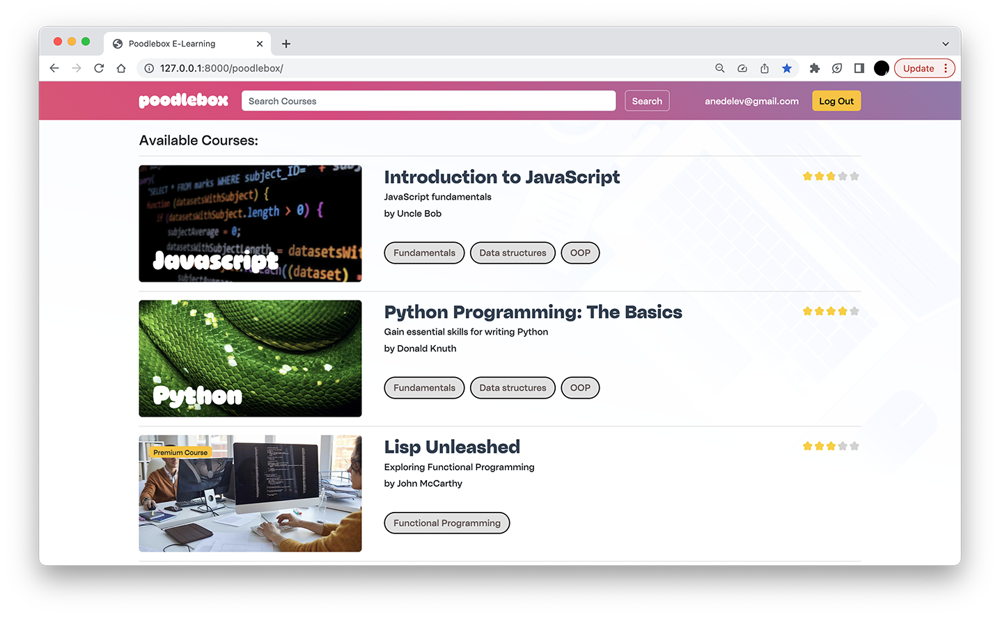
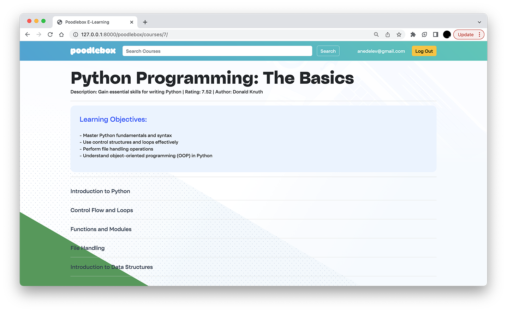
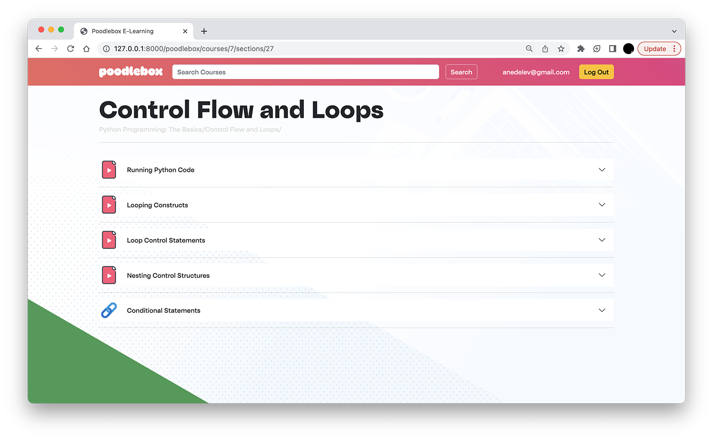
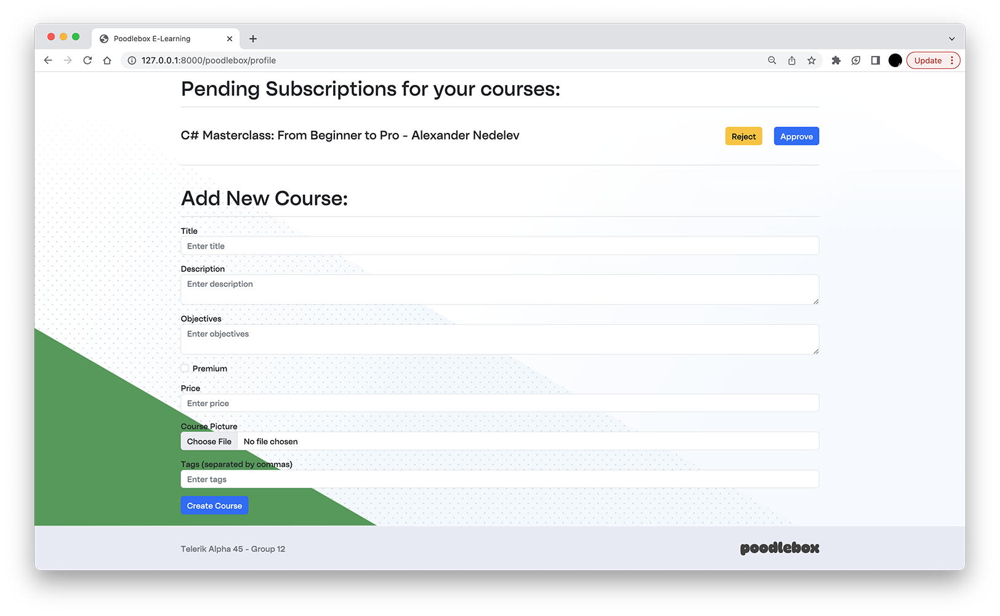

<h1 align="center">
  <br>
  <a href=""></a>
</h1>


## **Introduction**

Poodlebox is an e-learning platform API meticulously crafted as a showcase project for the Telerik Academy bootcamp. Developed with Python and FastAPI, Poodlebox exemplifies our proficiency in these technologies by delivering a functional API backend for efficient data processing in the realm of e-learning. Through this project, we demonstrate our ability to create a robust and scalable platform while showcasing the skills we have acquired during the bootcamp.

The Poodlebox project has been an invaluable learning experience, providing us with insights into the entire production cycle. Collaborating effectively as a team, we have tackled every stage, from initial planning and implementation to thorough testing and successful deployment. This hands-on approach has equipped us with the knowledge and expertise needed to build comprehensive web applications.

In addition to the API backend, we have developed a captivating live demo that combines HTML, CSS, Bootstrap, and Jinja to create an immersive user interface. This demo provides a glimpse into the features and functionality of Poodlebox, showcasing its potential as an e-learning solution.

Throughout the project, we have explored various aspects of web development, including the use of cloud databases in Azure and hosting our servers on platforms such as AWS and DigitalOcean. This has broadened our understanding of the entire process, from setting up the infrastructure to managing databases and deploying applications.

Poodlebox embodies our unwavering dedication to learning and our passion for technology. Join us as we unveil this showcase project, which not only demonstrates the possibilities of Python and FastAPI in e-learning but also highlights our growth as developers in the dynamic field of web development.

## **Team Members**

- [Alexander Nedelev](https://gitlab.com/anedelev)
- [Blagovesta Alexandrova](https://gitlab.com/newcopernicus)
- [Nikolai Dimitrov](https://gitlab.com/Nikolaisyl)


## **Table of Contents**

Essentials
- [Installation](#installation)
- [Technologies](#technologies-used)
- [Configuration](#configuration)
- [Requirements](#requirements)
- [Database Schema](#database-schema)

Endpoints
- [Authentication](#authentication)
- [Courses](#courses)
- [Students](#students)
- [Admins](#admins)
- [Ads](#ads)
- [Teachers](#teachers)
- [Calendars](#calendars)

Frontend
- [Live Demo](#live-demo)


## **Installation**

Clone this repository using
```sh
$ git clone https://gitlab.com/poodlebox-project-team-12/poodlebox
```
Enter the directory and install all the requirements using
```sh
$ pip3 install -r requirements.txt
```
Run the app using
```sh
$ python3 uvicorn main:app --reload
```
Navigate to 127.0.0.1:8000/docs to see the Swagger documentation

<h1 align="center">
  <a href="">
</h1>

## **Technologies**


          


## **Configuration**

The API can be configured using environment variables or .env file. The following variables need to be set:

Database Variables:

- `DB_NAME` - The name of the database.
- `DB_HOST` - The host address of the database.
- `DB_USER` - The username for connecting to the database.
- `DB_PASSWORD` - The password for connecting to the database.
- `DB_PORT` - The port number for the database connection.

Authentication Variables:

- `SECRET_KEY` - A secret key for securing sensitive information and generating tokens.
- `ACCESS_TOKEN_EXPIRES_MINUTES` - The expiration time for access tokens in minutes.
- `ALGORITHM` - The algorithm used for token generation.

Mailjet Variables:

- `API_KEY` - Mailjet API key for secure authentication.
- `API_SECRET` - Mailjet API key.

Video-Api Variables:

- `VIDEO_API_KEY` - The API key for video-related functionality.

Docker Variables:

- `DOCKER_TOKEN` - The token for authenticating with Docker registry.


## **Authentication**

The authentication section handles user registration and login. The authentication service includes the following components:

- **Password Hashing**: Passwords are hashed using the bcrypt algorithm to securely store them in the database.
- **Password Validation**: Passwords are validated to ensure they meet the required length and complexity criteria.
- **Token-based Authentication**: JWT (JSON Web Tokens) are used for token-based authentication. When a user logs in successfully, an access token is generated and returned. This access token must be included in the `Authorization` header of subsequent requests to authenticate the user.
- **Access Token Expiration**: Access tokens have an expiration time, typically set to 360 minutes (6 hours) by default. Users need to obtain a new access token after it expires.
- **User Verification**: Users can be marked as verified by updating their profile. This verification can be used to control access to certain endpoints or features.


## Database Schema

[Link to Schema Diagram](app/assets/schema_diagram.png)


## **Routers**


<h3>Authentication</h3>

<p> The authentication router manages the registration and login process for both teachers and students. Only an administrator has the authority to register a teacher, and the database is the only place where administrator privileges can be assigned. Registration of teachers can only be done by administrators. </p>


|` Method `|` Endpoint                                                                                          `|` Description             `|
|--------|---------------------------------------------------|-------------------------|
| POST   | `/api/authorization/registration/students`         | Register Student        |
| POST   | `/api/authorization/registration/teachers`         | Register Teacher        |
| POST   | `/api/authorization/login`                         | Login                   |

### Courses

<p> The courses router is responsible for handling all actions related to viewing courses, such as viewing the course itself and the available sections. These actions are available to both students and teachers. However, the modifying actions, such as creating (POST), updating (PUT), and deleting (DELETE), are separated into different routers for teachers and students. </p>


|` Method `|` Endpoint                                                                                          `|` Description             `|
|--------|---------------------------------------------------|-------------------------|
| GET    | `/api/courses/`                                   | Get All Courses         |
| GET    | `/api/courses/popular`                            | Get Most Popular Courses|
| GET    | `/api/courses/{course_id}`                         | Get Course By Id        |
| GET    | `/api/courses/{course_id}/sections/`               | Get Course Sections     |
| GET    | `/api/courses/{course_id}/sections/{section_id}`   | Get Section By Id       |
| POST   | `/api/courses/{course_id}/reviews`                 | Post Review             |
| PUT    | `/api/courses/{course_id}/status`                  | Change Course Status    |
| GET    | `/api/courses/pending_enrollments/reports`         | Get Pending Enrollments |
| PUT    | `/api/courses/pending_enrollments`                 | Judge Enrollment        |

### Students

<p> The students router exclusively handles actions related to students' profiles, such as course enrollment, profile updates, and viewing the courses in which they are enrolled. It focuses on providing functionalities specifically for student users.</p>

|` Method `|` Endpoint                                                                                     `|` Description             `|
|--------|---------------------------------------------------|-----------------------------|
| GET    | `/api/students/courses/certificates`               | Get Certificates Of Student                |
| GET    | `/api/students/courses/{course_id}/certificates`    | Get Certificate Of Student For Course       |
| GET    | `/api/students/courses`                            | Get Courses For Student                    |
| GET    | `/api/students/profiles`                           | Get Student Profile                        |
| PUT    | `/api/students/profiles`                           | Change Student Profile                     |
| GET    | `/api/students/courses/{course_id}`                 | Get Course For Student By Id               |
| PUT    | `/api/students/courses/{course_id}`                 | Enroll Or Unenroll From Course             |

### Admins

<p> The admins router is in charge of managing all administrative privileges, including tasks such as changing the status of students or courses, removing students from courses, and retrieving pending teacher registrations. It is specifically designed to handle actions and functionalities related to administrative tasks and responsibilities. </p>

|` Method `|` Endpoint                                                                                          `|` Description             `|
|--------|---------------------------------------------------|-------------------------|
| PUT    | `/api/admins/students/{student_id}/status/{disabled}` | Change Student Status |
| PUT    | `/api/admins/courses/{course_id}/status/{disabled}`  | Change Course Status  |
| PUT    | `/api/admins/courses/{course_id}/students/{student_id}` | Remove Student From Course |
| GET    | `/api/admins/registrations/`                       | Get Pending             |
| PUT    | `/api/admins/registrations/{teacher_id}`           | Approve                 |
<!-- | GET    | `/api/admins/ratings/traceback`                    | Traceback Ratings       | -->

### Ads

<p>Advertisement composed of three courses curated based on the most popular tags among students who have enrolled in or completed courses.</p>

|` Method `|` Endpoint                                                                                          `|` Description             `|
|--------|---------------------------------------------------|-------------------------|
| GET    | `/api/ads/`                                       | Get Users Ad            |

### Teachers

<p>The router for teachers encompasses various actions such as editing courses, managing teacher profiles, generating course reports, modifying course sections and content.</p>


|` Method `|` Endpoint                                                                                          `|` Description             `|
|--------|---------------------------------------------------|-------------------------|
| GET    | `/api/teachers/courses/reports`                    | Get Report              |
| GET    | `/api/teachers/profiles/`                          | View Profile            |
| PUT    | `/api/teachers/profiles/`                          | Edit Profile            |
| POST   | `/api/teachers/courses/`                           | Course Create           |
| POST   | `/api/teachers/courses/{course_id}/thumbnail`       | Upload Photo            |
| POST   | `/api/teachers/courses/{course_id}/sections/`       | Add Section             |
| PUT    | `/api/teachers/courses/{course_id}/sections/{section_id}` | Edit Section      |
| DELETE | `/api/teachers/courses/{course_id}/sections/{section_id}` | Delete Section    |
| POST   | `/api/teachers/courses/{course_id}/sections/{section_id}/content` | Add Content To Section |

### Calendars

<p>The calendar router is a powerful tool for managing calendars and events within the system. It provides a collection of endpoints that enable various operations related to calendars and events. </p>

|` Method `|` Endpoint                                                                                          `|` Description             `|
|--------|---------------------------------------------------|-------------------------|
| GET    | `/api/calendars/`                                 | Get All Calendars        |
| POST   | `/api/calendars/`                                 | Create Calendars         |
| GET    | `/api/calendars/{calendar_id}`                     | Get Calendar By Calendar Id |
| PUT    | `/api/calendars/{calendar_id}`                     | Change Calendar Owner    |
| GET    | `/api/calendars/{calendar_id}/events`              | Get Events For Calendar  |
| POST   | `/api/calendars/{calendar_id}/events`              | Add Event                |
| GET    | `/api/calendars/{calendar_id}/events/{event_id}`   | Get Event By Event Id    |
| PUT    | `/api/calendars{calendar_id}/events/{event_id}`    | Change Event             |
| DELETE | `/api/calendars/{calendar_id}/events/{event_id}`   | Delete Event             |

### More detailed information available through Open Api documentation at /docs or /redoc

```
Swagger Ui - http://127.0.0.1:8000/docs
Redoc - http://127.0.0.1:8000/redoc

```

## **Requirements**

The following are the important packages and dependencies required for this project:

- fastapi==0.95.0
- fastapi-jwt-auth==0.5.0
- mariadb==1.1.6
- pydantic==1.10.7
- uvicorn==0.21.1
- requests==2.31.0
- python-dotenv==1.0.0
- email-validator==1.1.3
- api.video==1.2.8
- mailjet==1.4.1

Make sure to have these dependencies installed in your environment before running the project. You can install them using the package manager of your choice (e.g., pip).


## **Live Demo**
If you want to see how Swagger will render your OpenAPI definition, you can try it out online at hhttp://164.92.206.29:8000/docs/.
We've provided live demo with custom frontend you can see here: http://164.92.206.29:8000/poodlebox/.


<h1 align="center" >
  Index Page
  <p>Listing all courses</p>
  <br>
  <a href=""></a>
</h1>

<h1 align="center" >
  Course Page
  <p>Selected course details and sections</p>
  <br>
  <a href=""></a>
</h1>

<h1 align="center" >
  Section Page
  <p>Selected section details and contents</p>
  <br>
  <a href=""></a>
</h1>

<h1 align="center" >
  Profile Page
  <p>Teachers profile page with pending enrollments and course creation form</p>
  <br>
  <a href=""></a>
</h1>


