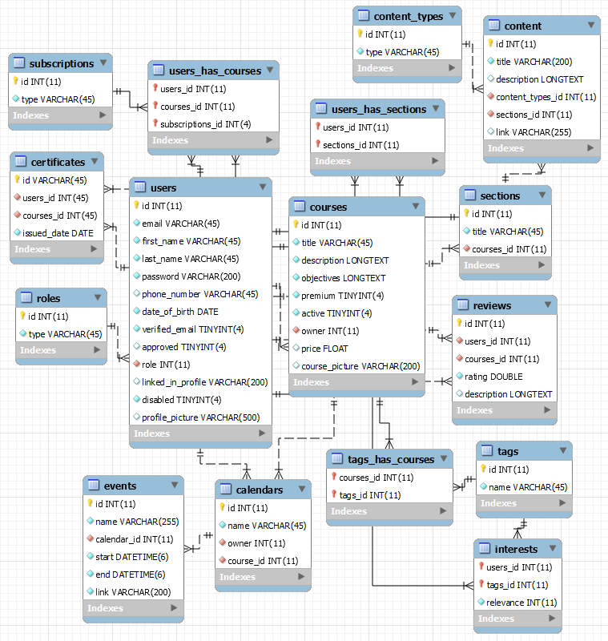

<h1 align="center">
  <br>
  <a href=""></a>
</h1>

## API Documentation

This API documentation provides details about the available endpoints and their functionalities.

## Database Schema

<h1 align="center">
  <br>
  <a href=""></a>
</h1>

## Technologies Used

The API is built using the following technologies:

- Framework: FastAPI
- Database: MariaDB
- Authentication: JWT (JSON Web Tokens)
- Mail Client: MailJet API

## Authentication


The authentication section handles user registration and login. The authentication service includes the following components:

- **Password Hashing**: Passwords are hashed using the bcrypt algorithm to securely store them in the database.
- **Password Validation**: Passwords are validated to ensure they meet the required length and complexity criteria.
- **Token-based Authentication**: JWT (JSON Web Tokens) are used for token-based authentication. When a user logs in successfully, an access token is generated and returned. This access token must be included in the `Authorization` header of subsequent requests to authenticate the user.
- **Access Token Expiration**: Access tokens have an expiration time, typically set to 360 minutes (6 hours) by default. Users need to obtain a new access token after it expires.
- **User Verification**: Users can be marked as verified by updating their profile. This verification can be used to control access to certain endpoints or features.


## Authentication

The authentication section handles user registration and login.

| Method | Endpoint                                 | Description                     |
|--------|------------------------------------------|---------------------------------|
| POST   | `/api/authorization/registration/students` | Register Student       |
| POST   | `/api/authorization/registration/teachers` | Register Teacher       |
| POST   | `/api/authorization/login`                 | Login                  |

## Courses

The courses section provides endpoints for managing courses and their sections.

| Method | Endpoint                                 | Description                     |
|--------|------------------------------------------|---------------------------------|
| GET    | `/api/courses/`                        | Get All Courses           |
| POST   | `/api/courses/`                        | Create Course             |
| GET    | `/api/courses/{course_id}`              | Get Course By Id          |
| GET    | `/api/courses/{course_id}/sections/`    | Get Course Sections       |
| POST   | `/api/courses/{course_id}/sections/`    | Add Section               |
| GET    | `/api/courses/{course_id}/sections/{section_id}` | Get Section By Id |
| POST   | `/api/courses/{course_id}/sections/{section_id}` | Add Content To Section |

## Students

The students section includes endpoints related to student profiles and course enrollment.

| Method | Endpoint                                 | Description                     |
|--------|------------------------------------------|---------------------------------|
| GET    | `/api/students/courses`                   | Get Courses For Student         |
| GET    | `/api/students/profiles`                  | Get Student Profile             |
| PUT    | `/api/students/profiles`                  | Change Student Profile          |
| GET    | `/api/students/courses/{course_id}`       | Get Course For Student By Id    |
| PUT    | `/api/students/courses/{course_id}`       | Enroll Or Unenroll From Course  |

Please refer to the API documentation for specific details about each endpoint.


<!-- 
<h4 align="center">E-Learning Portal of the Future<a href="" target="_blank"></a>.</h4>

<p align="center">
  <a href="https://badge.fury.io/js/electron-markdownify">
    
  </a>
  <a href="https://gitter.im/amitmerchant1990/electron-markdownify"></a>
  <a href="https://saythanks.io/to/bullredeyes@gmail.com">
      
  </a>
  <a href="https://www.paypal.me/AmitMerchant">
    
  </a>
</p>

<p align="center">
  <a href="#key-features">Key Features</a> •
  <a href="#how-to-use">How To Use</a> •
  <a href="#download">Download</a> •
  <a href="#credits">Credits</a> •
  <a href="#related">Related</a> •
  <a href="#license">License</a>
</p>


## Key Features

* LivePreview - Make changes, See changes
  - Instantly see what your Markdown documents look like in HTML as you create them.
* Sync Scrolling
  - While you type, LivePreview will automatically scroll to the current location you're editing.
* GitHub Flavored Markdown  
* Syntax highlighting
* [KaTeX](https://khan.github.io/KaTeX/) Support
* Dark/Light mode
* Toolbar for basic Markdown formatting
* Supports multiple cursors
* Save the Markdown preview as PDF
* Emoji support in preview :tada:
* App will keep alive in tray for quick usage
* Full screen mode
  - Write distraction free.
* Cross platform
  - Windows, macOS and Linux ready.

## How To Use

To clone and run this application, you'll need [Git](https://git-scm.com) and [Node.js](https://nodejs.org/en/download/) (which comes with [npm](http://npmjs.com)) installed on your computer. From your command line:

```bash
# Clone this repository
$ git clone https://github.com/amitmerchant1990/electron-markdownify

# Go into the repository
$ cd electron-markdownify

# Install dependencies
$ npm install

# Run the app
$ npm start
```

> **Note**
> If you're using Linux Bash for Windows, [see this guide](https://www.howtogeek.com/261575/how-to-run-graphical-linux-desktop-applications-from-windows-10s-bash-shell/) or use `node` from the command prompt.


## Download

You can [download](https://github.com/amitmerchant1990/electron-markdownify/releases/tag/v1.2.0) the latest installable version of Markdownify for Windows, macOS and Linux.

## Emailware

Markdownify is an [emailware](https://en.wiktionary.org/wiki/emailware). Meaning, if you liked using this app or it has helped you in any way, I'd like you send me an email at <bullredeyes@gmail.com> about anything you'd want to say about this software. I'd really appreciate it!

## Credits

This software uses the following open source packages:

- [Electron](http://electron.atom.io/)
- [Node.js](https://nodejs.org/)
- [Marked - a markdown parser](https://github.com/chjj/marked)
- [showdown](http://showdownjs.github.io/showdown/)
- [CodeMirror](http://codemirror.net/)
- Emojis are taken from [here](https://github.com/arvida/emoji-cheat-sheet.com)
- [highlight.js](https://highlightjs.org/)

## Related

[markdownify-web](https://github.com/amitmerchant1990/markdownify-web) - Web version of Markdownify

## Support

<a href="https://www.buymeacoffee.com/5Zn8Xh3l9" target="_blank"></a>

<p>Or</p> 

<a href="https://www.patreon.com/amitmerchant">
	
</a>

## You may also like...

- [Pomolectron](https://github.com/amitmerchant1990/pomolectron) - A pomodoro app
- [Correo](https://github.com/amitmerchant1990/correo) - A menubar/taskbar Gmail App for Windows and macOS

## License

MIT

---

> [amitmerchant.com](https://www.amitmerchant.com) &nbsp;&middot;&nbsp;
> GitHub [@amitmerchant1990](https://github.com/amitmerchant1990) &nbsp;&middot;&nbsp;
> Twitter [@amit_merchant](https://twitter.com/amit_merchant) -->